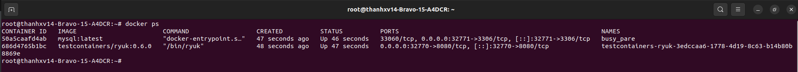

# Integration test
- Unit Test chi test tung method va se mock cac method dc su dung 
- Integration test se thuc thi toan bo method can test ma k mock 
  - Do k thuc hien mock nen Integration test tham chi tro ca xuong DBMS
  - Tro vao DBMS se anh huong den DB 
- Test Container ra doi de thuc hien Integration Test de khi test xong thi moi thu bien mat k luu lai
---
# Test Container
## Link reference
- https://www.youtube.com/watch?v=l_YtIt8b7fE&list=PL2xsxmVse9IaxzE8Mght4CFltGOqcG6FC&index=24
## Define
- Khi chay Unit Test thi se init 1 Container cua service va co the connect toi no va thuc hien nhu chay binh thuong

## Integration test sample
### Require
- Docker running

- Dependency
```xml
<dependency>
    <groupId>org.testcontainers</groupId>
    <artifactId>junit-jupiter</artifactId>
    <scope>test</scope>
</dependency>
<dependency>
    <groupId>org.testcontainers</groupId>
    <artifactId>mysql</artifactId>
    <scope>test</scope>
</dependency>
```
- dependencyManagement
```xml
<dependencyManagement>
    <dependencies>
        <dependency>
            <groupId>org.testcontainers</groupId>
            <artifactId>testcontainers-bom</artifactId>
            <version>1.19.7</version>
            <type>pom</type>
            <scope>import</scope>
        </dependency>
    </dependencies>
</dependencyManagement>
```

### Test with Test Container
```java
package com.thanhxv.controller;

import com.fasterxml.jackson.databind.ObjectMapper;
import com.fasterxml.jackson.datatype.jsr310.JavaTimeModule;
import com.thanhxv.dto.request.UserCreationRequest;
import com.thanhxv.dto.response.UserResponse;
import lombok.extern.log4j.Log4j2;
import org.junit.jupiter.api.BeforeEach;
import org.junit.jupiter.api.Test;
import org.springframework.beans.factory.annotation.Autowired;
import org.springframework.boot.test.autoconfigure.web.servlet.AutoConfigureMockMvc;
import org.springframework.boot.test.context.SpringBootTest;
import org.springframework.http.MediaType;
import org.springframework.test.context.DynamicPropertyRegistry;
import org.springframework.test.context.DynamicPropertySource;
import org.springframework.test.web.servlet.MockMvc;
import org.springframework.test.web.servlet.request.MockMvcRequestBuilders;
import org.springframework.test.web.servlet.result.MockMvcResultMatchers;
import org.testcontainers.containers.MySQLContainer;
import org.testcontainers.junit.jupiter.Container;
import org.testcontainers.junit.jupiter.Testcontainers;

import java.time.LocalDate;

@SpringBootTest
@Log4j2
@AutoConfigureMockMvc
@Testcontainers
public class UserControllerIntegrationTest {
    /**
     * explain Yeu cau can run docker
     */
    @Container
    static final MySQLContainer<?> MYSQL_CONTAINER = new MySQLContainer<>("mysql:latest");

    @DynamicPropertySource
    static void configureProperties(DynamicPropertyRegistry registry) {
        registry.add("spring.datasource.url", MYSQL_CONTAINER::getJdbcUrl);
        registry.add("spring.datasource.username", MYSQL_CONTAINER::getUsername);
        registry.add("spring.datasource.password", MYSQL_CONTAINER::getPassword);
        registry.add("spring.datasource.driverClassName", () -> "com.mysql.cj.jdbc.Driver");
        registry.add("spring.jpa.hibernate.ddl-auto", () -> "update");
    }

    /**
     * mockMvc se goi goi api
     */
    @Autowired
    private MockMvc mockMvc;

    private UserCreationRequest request;
    private UserResponse userResponse;

    /**
     * @BeforeEach chay truoc moi test case (@Test)
     */
    @BeforeEach
    void initData() {
        request = UserCreationRequest.builder()
                .username("bravof")
                .firstName("bravof")
                .lastName("bravof")
                .password("12345678")
                .dob(LocalDate.of(1990, 1, 1))
                .build();

        userResponse = UserResponse.builder()
                .id("1111111111")
                .username("bravof")
                .firstName("bravof")
                .lastName("bravof")
                .dob(LocalDate.of(1990, 1, 1))
                .build();
    }

    @Test
    /**
     * description
     */
    void createUser_validRequest_success() throws Exception {
        /**
         * 1 test case gom 3 phan
         */
        // GIVEN
        // Du lieu dau vao da biet truoc va du doan xay ra nhu vay
        ObjectMapper objectMapper = new ObjectMapper();
        objectMapper.registerModule(new JavaTimeModule());
        String content = objectMapper.writeValueAsString(request);

        // WHEN, THEN
        // Test cai gi
        mockMvc.perform(MockMvcRequestBuilders
                .post("/users")
                .contentType(MediaType.APPLICATION_JSON_VALUE)
                .content(content))
                .andExpect(MockMvcResultMatchers.status().isOk())
                .andExpect(MockMvcResultMatchers.jsonPath("code").value(1000))
                .andExpect(MockMvcResultMatchers.jsonPath("result.username").value("bravof"))
        ;

    }
}

```

### Result
- Khi chay Test Container se tao 2 container
  
- Khi chay xong se tu dong remove container