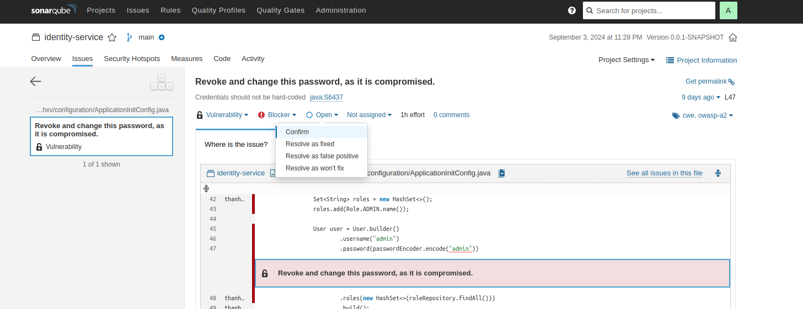

# Sonarqube
# Depend on Jacoco to report unit test

---
# Install sonarqube on local

## Docker 
- Search `sonarqube` on Docker hub then pull on local
```shell
docker pull sonarqube:lts-community
```

```shell
docker run --name sonar-qube -p 9000:9000 -d sonarqube:lts-community
```

## Access on browser
```shell
localhost:9000
```
- user/password : admin/admin
- then require change => admin/admin123

---
# How to scan
- Choose `Manual` from home page
- Input Project/Main branch => click `Set Up`
- Choose `Locally` vi dang scan tren local
- 1. Provide a token => vi local nen de `Expires` la `No Expiry` => `Generate`
- 2. Choose `Maven` vi project la maven => **SE NHAN DUOC 1 SCRIPT** => chay script do trong terminal cua project
  ```shell
    mvn clean verify sonar:sonar \
    -Dsonar.projectKey=thanhxv.identity \
    -Dsonar.host.url=http://localhost:9000 \
    -Dsonar.login=sqp_11f960b5c08a4b33248be06ecb37924a02d2dba7

> Voi Win thi phai chay bang Command Prompt moi dc

---
# How to use ?
## Mark Resolve as won't fix
- Neu co bug trong du tinh va chon `Resolve as won't fix` de lan sau scan khong detect loi do nua
